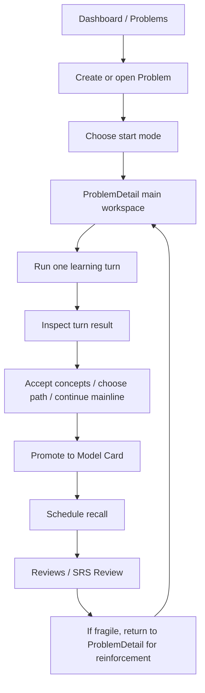

# Cogniforge 产品定位与学习使用流程参考

更新时间：2026-03-12

用途：
- 作为下一阶段 UI 优化的参考基线
- 统一团队对“这个产品是什么”以及“用户一次学习到底怎么走”的理解
- 避免后续为了修界面而误伤已有的学习协议和主线结构

本文不是营销文案，也不是技术实现细节说明。它的目标是给产品、设计、前端一个共同的判断标准。

---

## 1. 产品定位

### 1.1 Cogniforge 是什么

Cogniforge 是一个“结构化认知构建系统”，不是泛聊天应用。

它的核心不是“和 AI 聊聊”，而是把一次学习过程组织成可追踪、可回流、可沉淀的认知闭环：

1. 围绕一个 `Problem` 开始学习
2. 在学习过程中进入显式的学习协议
3. 每一轮交互产生结构化结果
4. 结构化结果沉淀为概念、路径、知识卡
5. 知识卡进入复习系统
6. 复习脆弱点再把用户带回工作区强化

换句话说，Cogniforge 解决的不是“AI 回答了没有”，而是：

- 用户是否真的在学
- 用户当前卡在哪个知识缺口
- 系统是否知道下一步该补什么
- 新得到的知识是否被沉淀成长期资产
- 后续是否能被复习和再强化

### 1.2 Cogniforge 不是什么

它不应该被优化成以下形态：

- 一个更花哨的 ChatGPT 壳
- 一个只做问答、不做结构沉淀的解释器
- 一个只有卡片复习、没有工作区学习主线的 SRS 工具
- 一个只有知识库展示、没有学习协议的内容管理系统

### 1.3 核心价值主张

对用户来说，Cogniforge 的价值不在“回答得多”，而在：

- 帮我明确当前在学什么
- 帮我发现真正的知识缺口
- 帮我决定下一步补什么
- 帮我把学习结果变成长期可复用资产
- 帮我在遗忘时重新回到正确的学习上下文

---

## 2. 用户在系统里到底做什么

### 2.1 用户的核心任务

用户在 Cogniforge 里的核心任务，不是单纯“提问”或“答题”，而是完成下面这条链路：

1. 确立一个想解决的问题
2. 选择一种学习方式开始推进
3. 在当前步骤里完成一轮有效学习
4. 看清这一轮产出了什么
5. 决定是继续主线、进入分支，还是补前置
6. 把值得保留的结果沉淀为知识资产
7. 在未来复习中重新激活这些知识

### 2.2 两种学习协议

系统里必须显式存在两种学习协议。

#### A. Socratic

系统提问，用户作答，系统评估是否掌握。

这个协议用于：
- 检测理解深度
- 明确当前缺口
- 给出 mastery signal
- 决定是否推进步骤

用户的心理模型应该是：

> 我正在被引导和评估，系统会告诉我我会了多少、还差什么。

#### B. Exploration

用户提问，系统解释，并从解释中提取结构化学习结果。

这个协议用于：
- 解释概念
- 边界澄清
- 比较不同概念
- 发现前置知识
- 生成派生概念与路径候选

用户的心理模型应该是：

> 我正在围绕当前步骤主动探索，系统不仅回答，还会帮我发现接下来值得学什么。

### 2.3 一轮学习不是瞬时聊天

在 Cogniforge 里，一轮交互不是 ephemeral chat turn，而是一个能产生结构化结果的学习回合。

一轮回合应该至少可能产生以下结果中的一部分：

- 掌握度信号
- 建议继续追问的缺口
- 派生概念候选
- 派生路径候选
- 回主线或进入分支的建议
- 复习或强化信号

这也是为什么 `ProblemDetail` 必须是主工作区，而不是把结果拆散到多个次级页面。

---

## 3. 核心对象与页面职责

### 3.1 系统里的核心对象

UI 优化必须围绕下面这些对象组织，而不是围绕“页面组件”组织。

#### Problem
- 一次学习任务的锚点
- 用户围绕它展开探索、作答、分支和复习回流

#### Learning Path
- 问题下的学习路径结构
- 包括：
  - 主路径
  - prerequisite path
  - comparison path
  - branch deep dive

#### Turn
- 一次真实学习回合
- 必须和 learning mode、source turn、turn result 绑定

#### Derived Concept Candidate
- 交互过程中产生的概念候选
- 后续可以接受、提升、加入复习

#### Derived Path Candidate
- 交互过程中产生的路径候选
- 后续可以保存为分支、前置路径、比较路径

#### Model Card
- 被沉淀下来的长期知识资产
- 不是回合临时结果，而是长期对象

#### SRS Schedule / Review State
- 知识资产进入长期复习体系后的状态
- 同时也是把用户带回工作区强化的触发器

### 3.2 页面职责

#### Dashboard
回答一个问题：

> 我现在最应该继续哪件事？

它是分发页，不是学习主战场。

#### Problems
回答两个问题：

> 我要学哪个问题？
> 我要新建一个什么问题？

它是 Problem 入口页，不是主要学习界面。

#### ProblemDetail
回答五个问题：

> 我现在在做什么？
> 我当前在什么路径上？
> 我处于哪种学习模式？
> 这一轮产生了什么？
> 我下一步该做什么？

它是系统最重要的主工作区。

#### Model Cards
回答：

> 我已经沉淀了哪些长期知识资产？

#### Reviews / SRS Review
回答：

> 现在先复习什么？
> 哪个知识点已经脆弱，需要回工作区强化？

---

## 4. 用户的一次完整学习路径

下面这条路径，不是理论设想，而是当前产品模型应该长期稳定支持的“标准学习闭环”。

### 4.1 进入系统

用户进入系统后，通常从两种入口开始：

1. Dashboard
2. Problems

Dashboard 的职责是“继续当前优先任务”，不是展示所有东西。
Problems 的职责是“进入一个具体问题”。

### 4.2 新建 Problem

用户新建一个问题时，实际上是在声明一个学习目标，而不是在发一条聊天消息。

例如：
- 什么是 XGBoost
- PID 中积分项到底在解决什么问题
- 为什么精确率和召回率在阈值变化下会互相拉扯

这一步的结果不是答案，而是一个 `Problem` 工作区。

### 4.3 选择起始模式

新建 Problem 后，用户需要决定从哪种协议开始：

#### 起点 A：Socratic
适合：
- 用户希望被引导
- 用户要检测自己是否真的理解
- 用户已有一点认识，但不确定掌握程度

#### 起点 B：Exploration
适合：
- 用户对主题还比较生
- 用户先想听解释
- 用户希望从解释中发现更多值得学的概念和分支

这里的关键不是“用户选哪个更酷”，而是让用户知道当前是：
- 我在被评估
- 还是我在主动探索

### 4.4 进入 ProblemDetail 主工作区

一旦进入 `ProblemDetail`，用户应该始终能看清下面五件事：

1. 当前问题
2. 当前路径
3. 当前模式
4. 当前步骤
5. 下一步动作

如果 UI 不能稳定回答这五件事，学习体验就会变成“我一直在操作，但不知道自己是不是在推进”。

### 4.5 进行一轮学习

#### 在 Socratic 中

典型流程是：

1. 系统给出问题
2. 用户回答
3. 系统判断掌握度与缺口
4. 系统决定是否推进步骤
5. 用户看到：
   - 掌握得怎样
   - 错在哪里
   - 还差什么
   - 下一题为什么这么问

正确的体验不是“只有分数”，而是：

> 我知道自己答得如何，也知道问题出在哪。

#### 在 Exploration 中

典型流程是：

1. 用户围绕当前步骤提问
2. 系统给出解释
3. 系统从这轮解释里提取：
   - answered concepts
   - related concepts
   - derived concepts
   - derived path candidates
4. 用户决定：
   - 继续问
   - 接受概念
   - 提升知识卡
   - 进入某条新路径

正确的体验不是“系统答完一大段”，而是：

> 这轮解释让我更清楚了，而且我知道它产出了哪些值得保留的东西。

### 4.6 前置补课与分支学习

这是当前 UI 最容易表达不清的地方。

当系统判断用户当前其实缺的是前置知识时，正确的结构应该是：

1. 明确识别当前缺口
2. 进入一个显式的 prerequisite branch
3. 在 branch 内只补一个明确目标
4. branch 通过后，再返回主路径

正确体验应该像：

> 你在学 XGBoost，但你卡在 boosting。
> 先去补 boosting 的基本机制。
> 补完后，再回到 XGBoost 的这一步继续。

而不应该像：

> Step 1 里混着主问题、前置问题、返回指令和系统调度语句。

### 4.7 派生产物治理

一轮交互后，用户不只是继续提问，还会处理这轮产生的结构化结果。

包括：

#### 概念候选
- 接受
- 忽略
- 提升为 model card
- 加入复习

#### 路径候选
- 保存为 prerequisite
- 保存为 comparison path
- 保存为 branch deep dive
- 暂不处理

这里的原则是：

> 派生产物应该支持学习，但不应该压过主学习动作。

### 4.8 沉淀为长期知识资产

当一个概念足够清晰后，用户可以把它提升为 `Model Card`。

这一步意味着：
- 它不再只是本轮 turn 的产物
- 它变成长期维护和复习的对象

### 4.9 进入复习

用户进入 `Reviews` / `SRS Review` 后，系统回答的应该是：

> 现在先复习哪个？

复习不是独立宇宙，它是学习闭环的一部分。

### 4.10 复习后回流强化

如果某个知识点在复习中暴露为脆弱，系统应该把用户重新带回 `ProblemDetail`。

但不是简单跳回去，而是带着明确上下文：

- 要强化哪个概念
- 为什么它脆弱
- 建议先做什么
- 当前关联到哪个问题 / 哪条路径

这一步是 Cogniforge 和普通问答工具、普通 SRS 工具的本质差异之一。

---

## 5. UI 优化时必须维护的结构约束

### 5.1 ProblemDetail 必须继续是主工作区

不能把核心学习动作拆散到：
- 一个页面问
- 一个页面看结果
- 一个页面处理概念
- 一个页面处理路径

这样会破坏学习回合的完整性。

### 5.2 必须显式表达 learning mode

不能把 Socratic 和 Exploration 做成看起来差不多、只是按钮文字不同的两个入口。

用户必须清楚知道自己当前是：
- 在被评估
- 还是在主动探索

### 5.3 必须显式表达 path position

用户必须知道自己当前在：
- main path
- prerequisite branch
- comparison path
- branch deep dive

并且必须知道如何回主线。

### 5.4 必须显式表达 turn outcome

一轮学习之后，用户至少要知道：

1. 这一轮有没有通过 / 推进
2. 这一轮产生了哪些概念
3. 这一轮产生了哪些路径建议
4. 下一步最推荐做什么

### 5.5 主动作优先于治理动作

用户首屏首先要看到的是学习动作，而不是治理动作。

优先级应该是：

1. 当前任务
2. 当前模式
3. 当前步骤
4. 下一步动作
5. 本轮产出
6. 概念/路径治理
7. Notes / Resources / Export 等工具动作

---

## 6. 目前用户感觉“不顺”的根因

结合当前实现和最近真实 session，可以把“不顺”归纳成下面几类问题。

### 6.1 系统已经有学习结构，但表达得不够清楚

主线不是没有，而是：
- 主线
- 分支
- 前置
- 概念治理
- 复习回流

这些东西一起冒出来，用户很难一眼抓住当前目标。

### 6.2 缺口诊断表达不够直接

如果用户只看到分数，而没有看到：
- 具体错在哪
- 哪个关键点缺失
- 下一题为什么还在追问这个

就会觉得自己一直在答，但没有向前推进。

### 6.3 前置补课和主线推进混在一起

如果系统发现需要先补某个前置概念，就应该显式切 branch。
如果仍然把主问题、前置补课和返回主线揉在一个步骤说明里，用户会失去方向感。

### 6.4 Turn 产物和历史产物边界容易混

用户应能区分：
- 当前这轮刚产生的东西
- 之前历史轮次留下的东西

否则会不清楚哪些是“我现在应该处理的”，哪些只是历史痕迹。

### 6.5 页面布局放大了结构问题

如果布局把多个平级面板同时抬上首屏，就会把“学习结构表达不清”的问题进一步放大。

---

## 7. 下一轮 UI 优化应以什么为目标

下一轮 UI 优化，不应该先追求“更好看”，而应该先追求“更容易知道现在在干什么”。

建议目标按顺序定义为：

### 目标 1
进入 `ProblemDetail` 后，用户 3 秒内能回答：

- 我现在在哪个问题里？
- 我在什么模式？
- 我在什么路径的哪一步？
- 我下一步要做什么？

### 目标 2
完成一轮交互后，用户 5 秒内能回答：

- 这一轮结果怎样？
- 系统认为我哪里还不够？
- 这轮产生了什么值得处理的东西？

### 目标 3
当进入分支或前置补课时，用户能明确感知：

- 为什么离开主线
- 现在补的是什么
- 什么情况下会回主线

### 目标 4
当进入 Reviews / SRS 时，用户能明确感知：

- 现在先复习哪个
- 为什么先复习它
- 如果脆弱，怎么回工作区强化

---

## 8. 对 UI 设计和实现的直接指导

### 8.1 设计时优先组织“当前学习合同”

`ProblemDetail` 首屏最重要的不是多信息，而是一个清晰的学习合同：

- 当前模式
- 当前路径
- 当前步骤
- 本轮任务
- 下一步动作

### 8.2 不要把工具动作放到首屏一级

这类动作应该降级：

- 导出学习过程
- 打开 Review Hub
- 打开 Model Cards
- Notes / Resources

它们重要，但不是首屏主动作。

### 8.3 把“当前回合”与“历史结果”明显分层

用户当前要处理的东西应该永远先于历史记录显示。

### 8.4 分支要像“进入一个明确学习单元”，不是像“界面状态变化”

进入 prerequisite / comparison branch 时，应该显式告诉用户：

- 当前分支名称
- 分支原因
- 返回点

### 8.5 复习回流必须带上下文

从 Reviews 回到 ProblemDetail 时，UI 不能只把用户丢回一个页面，而要告诉他：

- 当前要强化哪个概念
- 建议先做哪个动作
- 这个动作和哪条学习记录有关

---

## 9. 一句话总结

Cogniforge 的本质，不是“AI 帮用户回答问题”，而是“AI 帮用户把一次学习组织成可推进、可分支、可沉淀、可复习、可回流强化的结构化认知过程”。

因此，UI 优化的核心任务也不是“把页面做简洁”，而是：

> 让用户始终知道自己当前在这条学习结构中的什么位置、为什么在这里、这一轮产出了什么、以及下一步该做什么。

