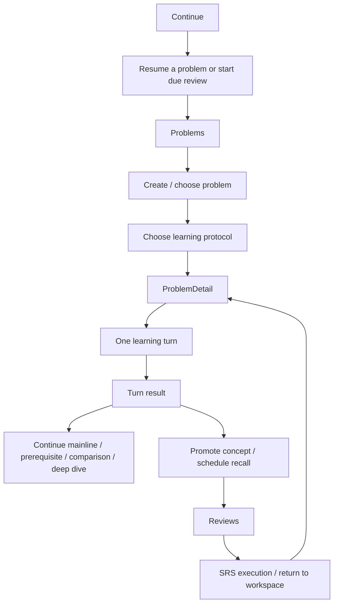

# Cogniforge 主线信息架构重组方案

更新时间：2026-03-12

用途：
- 作为下一阶段 UI / UX 重构的主线 IA 依据
- 统一 `Dashboard / Problems / ProblemDetail / Reviews` 四个页面的职责与关系
- 从用户学习任务出发，而不是从现有路由、现有组件和现有卡片出发

这份文档讨论的是：
- 用户应该通过哪些主入口进入系统
- 每个页面只回答什么问题
- 主线页面之间如何衔接
- 哪些 surface 应该降级

它不讨论：
- 具体视觉样式
- 组件拆分
- 现有代码怎么最小修改

---

## 1. 北极星

Cogniforge 的信息架构不应该围绕“系统里有哪些功能”组织，而应该围绕“用户如何完成一次结构化学习”组织。

唯一正确的主线应该是：

```text
进入系统 -> 选定问题 -> 进入学习协议 -> 完成一轮学习 -> 看懂结果 -> 决定继续/分支/补前置 -> 沉淀知识 -> 复习 -> 回流强化
```

因此，主线 IA 的目标不是“功能都能找到”，而是：

> 用户在任何时刻都知道自己现在是在继续问题、正在学习、还是正在复习。

---

## 2. 目标信息架构

### 2.1 一级信息架构

我建议最终收口为 3 个一级主入口，1 个上下文工作区，1 个次级资产面。

#### 一级主入口

1. `Continue`
2. `Problems`
3. `Reviews`

#### 上下文工作区

4. `ProblemDetail`

#### 次级资产面

5. `Model Cards`

#### 降级为次级/工具面

- Chat
- Practice
- Notes
- Resources
- Challenges
- Knowledge Graph

### 2.2 为什么不是四个一级主入口

当前系统主导航虽然已经压成：
- Dashboard
- Problems
- Model Cards
- Reviews

但从学习主线看，`Model Cards` 不应该和 `Problems`、`Reviews` 同级抢心智。

原因很简单：

- `Problems` 是学习任务入口
- `ProblemDetail` 是学习执行面
- `Reviews` 是复习执行面
- `Model Cards` 是知识资产库

资产库重要，但它不是大多数用户每天最常执行的一级任务。

所以从长期看，更合理的 IA 是：

- 一级只保留“继续 / 学习 / 复习”
- `Model Cards` 降成次级主面或从 `Reviews` / `ProblemDetail` / `Problems` 上下文进入

如果短期不改导航，也应该在文案和视觉权重上把 `Model Cards` 进一步降级。

---

## 3. 用户主线地图



### 3.1 用户只有三种主状态

从用户感知看，整个产品只应让人进入三种主状态：

1. `我正在找下一件要做的事`
2. `我正在围绕一个问题学习`
3. `我正在复习和强化`

如果 IA 让用户进入第四种状态：

- `我在治理一堆系统对象`

那就已经偏了。

---

## 4. 每个页面应该只回答一个核心问题

---

## 4.1 Continue

### 核心问题

> 我现在最该继续什么？

### 它不该做什么

- 不做详细学习
- 不做大量治理
- 不做知识资产浏览
- 不做复盘归档

### 它该承载的内容

只保留三类内容：

1. 最优先动作
   - 继续某个 Problem
   - 开始 due review

2. 轻量状态摘要
   - 活跃问题数
   - 待复习数
   - 资产规模

3. 次一级入口
   - 去 Problems
   - 去 Reviews

### 它的正确角色

`Continue` 是分发页，不是学习页。

它的成败标准不是内容丰富，而是用户能不能在 3 秒内点下一个动作。

### 对当前 Dashboard 的直接结论

当前首页已经接近这个角色，基本过线。

后续不应该继续往里面塞更多东西，而应该继续压缩为：

- 一个焦点动作
- 两到三个状态摘要
- 一个轻量继续列表

---

## 4.2 Problems

### 核心问题

> 我现在要学哪个问题？

### 它不该做什么

- 不进入深度学习
- 不做模式切换的长期驻留
- 不承担知识治理
- 不承担复习执行

### 它该承载的内容

1. 问题列表
2. 搜索/筛选
3. 新建问题
4. 新建后选择起始协议

### 它的正确角色

`Problems` 是学习任务目录。

它不是“轻量工作区”，也不是“问题 + 模式 + 局部学习”的混合页。

### 关键 IA 约束

#### 创建问题后，必须明确进入协议选择

正确顺序应该是：

1. 创建 Problem
2. 选择起始协议
3. 进入 ProblemDetail

而不是：

1. 创建 Problem
2. 进入 ProblemDetail
3. 再在工作区里想自己到底是答题还是提问

#### 两个协议都必须是显式状态

不能再允许：
- Socratic 是默认值
- Exploration 是显式值

从 IA 角度看，这会让产品逻辑在入口处失真。

---

## 4.3 ProblemDetail

### 核心问题

> 我现在如何围绕这个问题，完成当前这一轮学习？

### 它不该做什么

它不应该再是：

- 治理后台
- 多入口导航台
- 资产控制台
- 复盘中心

### 它该承载的内容

只围绕一次学习回合组织：

1. 当前学习定位
2. 当前学习合同
3. 当前回合动作
4. 当前回合结果
5. 回合后决策

### 它的正确角色

`ProblemDetail` 是系统真正的主工作台。

它不是一个“把所有相关东西都放进来”的大页面。
它是一个围绕当前问题、当前路径、当前步骤、当前协议展开的学习执行面。

### 结构上的绝对原则

#### 首先要有单一主轨道

页面从上到下只承载这一条链：

```text
当前任务 -> 当前回合动作 -> 本轮结果 -> 回合后处理
```

#### 结果不能隐藏在产物区

Turn result 是学习结果反馈，不是治理操作的一部分。

用户提交后，第一眼必须看到：

- 是否推进
- 为什么
- 哪个点没懂
- 推荐下一步

然后才是：

- 概念候选
- 路径候选
- 提升知识卡
- 加入复习

#### 概念和路径治理必须降级

它们很重要，但它们是“回合后处理阶段”，不是“当前回合动作阶段”。

#### 工具动作全部降级

以下都不应该再占 ProblemDetail 首屏一级：

- Export
- Open Review Hub
- Open Model Cards
- Notes
- Resources

### 页面在 IA 里的定位

如果 `Continue` 是“找下一步”，`Problems` 是“选问题”，`Reviews` 是“做复习”，那么 `ProblemDetail` 就是：

> 真正发生学习的地方

所以它必须是整个 IA 中最清晰、最不应该迷路的页面。

---

## 4.4 Reviews

### 核心问题

> 现在先复习什么？如果脆弱，怎么回去强化？

### 它不该做什么

- 不做复盘归档主入口
- 不做 review 报告生成台
- 不做通用知识管理台

### 它该承载的内容

只保留：

1. 当前 due review
2. 当前需要强化的项目
3. 回工作区入口

### 它的正确角色

`Reviews` 不是内容中心，而是复习调度中心。

用户进入后，最重要的问题只有一个：

> 现在先复习哪个？

### 当前 Reviews 的正确改造方向

保留：
- Focus CTA
- due queue
- return to workspace / open model card

降级或移走：
- archive
- new review generator
- 长段复盘内容

这些可以保留功能，但不应继续和复习主任务同级。

---

## 5. Model Cards 在主线 IA 中的位置

### 5.1 Model Cards 不是主线入口

它非常重要，但它不是用户每天最应该先去的地方。

它是：
- 学习结果的沉淀地
- 复习对象的载体
- 长期知识资产库

### 5.2 它在 IA 中应该是“资产面”

也就是说：

- 可以从 Problems / ProblemDetail / Reviews 进入
- 但不应与主学习和主复习同权争夺顶部心智

### 5.3 短期与长期策略

#### 短期
- 导航保留
- 但视觉和文案上降级

#### 长期
- 视产品方向，可考虑降成 Library / Knowledge Assets
- 或从一级导航退到次级

---

## 6. Secondary surfaces 应如何处理

这些页面并不是都要删除，但需要明确 IA 地位：

- Chat
- Practice
- Notes
- Resources
- Challenges
- Knowledge Graph

### 原则

#### A. 不再进入主导航主心智

除非它们重新接入主学习闭环，否则不应继续和主线并列。

#### B. 只通过上下文进入

例如：
- 从 ProblemDetail 打开资源
- 从复习页打开某个知识图谱节点

而不是让用户从顶层导航进入一个平行宇宙。

#### C. 明确标记 secondary / legacy 不是终点

当前 `Chat` / `Practice` 已经通过文案承认自己是 secondary/legacy，这说明产品认知上已经知道它们不在主线里。
下一步不该停在“加个 banner”，而应该真正在 IA 上把它们降级。

---

## 7. 最终主导航建议

### 7.1 推荐版

一级导航：

1. `Continue`
2. `Problems`
3. `Reviews`

次级导航或上下文入口：

4. `Model Cards`
5. `Admin`

工具面全部移出一级。

### 7.2 过渡版

如果短期不动一级导航结构，也应至少做到：

- Dashboard 文案明确为 `Continue Learning`
- `Model Cards` 在视觉上降级
- Secondary surfaces 不进入主导航

---

## 8. 四个主页面之间的正确跳转关系

### 8.1 Continue -> Problems

当用户没有明确的当前优先项时，从 `Continue` 进入 `Problems` 选择问题。

### 8.2 Problems -> ProblemDetail

这是最主要的学习入口。

### 8.3 ProblemDetail -> Reviews

不是常态主跳转，而是当：
- 已经有可复习知识
- 或用户要查看 recall 状态

### 8.4 Reviews -> ProblemDetail

这是主线闭环里非常关键的一跳：

> 当知识脆弱时，用户必须能带着上下文回到工作区强化

### 8.5 ProblemDetail -> Model Cards

应该是上下文化跳转，而不是主跳转。

也就是说：
- 是从当前概念出发打开某张卡
- 不是把用户从学习动作中拉走去浏览资产库

---

## 9. 产品主线重构的优先顺序

### 第一优先级：收口 IA

先确定：

- 一级主入口是什么
- 哪些页面只是次级面
- ProblemDetail 只承担什么
- Reviews 只承担什么

### 第二优先级：重建 ProblemDetail

重建方式：
- 先定主轨道
- 再定结果区
- 最后接回后处理区

### 第三优先级：重构 Reviews

把复盘归档和生成器移走或降级。

### 第四优先级：彻底降级 secondary surfaces

不再让平行学习表面继续占主心智。

---

## 10. 一句话结论

下一阶段的 UI / UX 重构，不应该再围绕“把现有页面调整一下”，而应该围绕：

> 让 Cogniforge 的主线信息架构真正收敛成三件事：继续学习、围绕问题学习、复习并回流强化。

只要这个 IA 没收口，`ProblemDetail` 再怎么调布局，用户还是会迷路。

