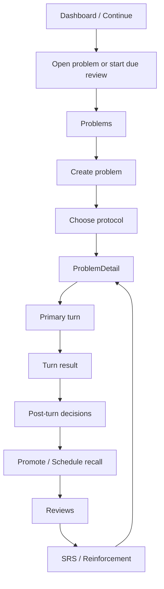

# Cogniforge 主线四页低保真草图说明

更新时间：2026-03-12

用途：
- 把主线 IA 和四页线框进一步落成“可直接讨论页面结构”的低保真草图
- 用于判断主轴、信息层级、跳转关系是否正确
- 不讨论视觉风格，只讨论页面骨架

相关文档：
- [主线信息架构重组方案](/Users/asteroida/work/Cogniforge/docs/plans/2026-03-12-mainline-ia-restructure-zh.md)
- [主线四页线框说明](/Users/asteroida/work/Cogniforge/docs/plans/2026-03-12-mainline-wireframe-spec-zh.md)
- [ProblemDetail 主学习工作区重构原则](/Users/asteroida/work/Cogniforge/docs/plans/2026-03-12-problemdetail-rebuild-principles-zh.md)

---

## 1. 使用方式

这份草图只回答三个问题：

1. 用户第一眼先看到什么
2. 用户接下来做什么
3. 页面底部或次级区才出现什么

判断标准不是“好不好看”，而是：

- 用户会不会迷路
- 学习动作会不会被治理动作打断
- 页面是不是围绕任务链，而不是围绕组件堆叠

---

## 2. Dashboard / Continue 草图

### 页面目标

让用户在 3 秒内点下一个动作。

### 草图

```text
┌──────────────────────────────────────────────────────────────┐
│ Continue Learning                                           │
│ Resume the most important task now                          │
├──────────────────────────────────────────────────────────────┤
│ FOCUS CARD                                                  │
│ ---------------------------------------------------------- │
│ [Priority now]                                              │
│ Continue: XGBoost 是什么                                    │
│ You last stopped at: prerequisite branch / step 2          │
│ [Continue Problem]                                         │
│ or                                                         │
│ [Start Due Review]                                         │
├──────────────────────────────────────────────────────────────┤
│ Metrics                                                     │
│ [Active Problems] [Due Reviews] [Model Cards]              │
├──────────────────────────────────────────────────────────────┤
│ Recent Problems                                             │
│ - XGBoost 是什么                           [Open Workspace] │
│ - PID 为什么需要积分项                     [Open Workspace] │
│ - 精确率和召回率有什么区别                 [Open Workspace] │
├──────────────────────────────────────────────────────────────┤
│ Due Review Preview                                          │
│ - Precision vs Recall card                  [Start Review]  │
│ - Boosting basics                           [Start Review]  │
└──────────────────────────────────────────────────────────────┘
```

### 关键点

- Focus Card 必须压住其他内容
- Recent Problems 和 Due Review Preview 都是次级区
- 不出现治理、归档、导出、知识操作

---

## 3. Problems 草图

### 页面目标

让用户快速：
- 找到一个问题继续
- 或新建一个问题并明确起始协议

### 草图 A：问题列表

```text
┌──────────────────────────────────────────────────────────────┐
│ Problems                                     [New Problem]  │
│ Choose a problem to continue learning                       │
├──────────────────────────────────────────────────────────────┤
│ [Search____________] [Mode v] [Status v] [Sort v]          │
├──────────────────────────────────────────────────────────────┤
│ Problem Card                                                │
│ ---------------------------------------------------------- │
│ XGBoost 是什么                                              │
│ 想搞清楚它和 boosting、树模型之间的关系                    │
│ in-progress · exploration · 4 concepts                     │
│ [Open Workspace]                                            │
├──────────────────────────────────────────────────────────────┤
│ Problem Card                                                │
│ ---------------------------------------------------------- │
│ PID 控制中的积分项                                          │
│ 想知道积分项到底解决什么问题                                │
│ new · socratic · 2 concepts                                │
│ [Open Workspace]                                            │
└──────────────────────────────────────────────────────────────┘
```

### 草图 B：新建问题

```text
┌──────────────────────────────────────────────┐
│ New Problem                                  │
├──────────────────────────────────────────────┤
│ Title                                        │
│ [__________________________________________] │
│                                              │
│ Description                                  │
│ [__________________________________________] │
│ [__________________________________________] │
│                                              │
│ Concept seeds (optional)                     │
│ [__________________________________________] │
│                                              │
│                          [Cancel] [Create]   │
└──────────────────────────────────────────────┘
```

### 草图 C：选择起始协议

```text
┌──────────────────────────────────────────────────────────────┐
│ How do you want to start learning this problem?            │
├──────────────────────────────────────────────────────────────┤
│ [Start with Socratic]                                      │
│ AI asks questions, evaluates your understanding, and       │
│ decides whether you should move forward.                   │
│                                                            │
│ [Start with Exploration]                                   │
│ You ask about the concept, AI explains, and the system     │
│ derives related concepts and next learning paths.          │
│                                                            │
│                                            [Close]         │
└──────────────────────────────────────────────────────────────┘
```

### 关键点

- 协议选择是完整步骤，不是轻飘飘 toggle
- 两种协议同权，不存在“一个默认、一个显式”

---

## 4. ProblemDetail 草图

### 页面目标

让用户围绕当前问题，完成一轮学习，并立刻看懂结果。

### 草图

```text
┌──────────────────────────────────────────────────────────────┐
│ XGBoost 是什么                                              │
│ Main Path · Step 2/5 · Exploration                         │
├──────────────────────────────────────────────────────────────┤
│ CURRENT LEARNING CONTRACT                                   │
│ ---------------------------------------------------------- │
│ Current goal                                                │
│ 先理解 boosting 为什么不是“多个模型投票”                    │
│                                                            │
│ Why now                                                     │
│ 这是理解 XGBoost 工作机制的前置知识                         │
│                                                            │
│ Complete this turn when                                     │
│ 你能用一个具体例子解释“后一个学习器如何纠正前一个错误”      │
├──────────────────────────────────────────────────────────────┤
│ PRIMARY TURN AREA                                           │
│ ---------------------------------------------------------- │
│ Ask about the current concept                              │
│ [________________________________________________________] │
│ [________________________________________________________] │
│                                           [Ask and Learn]  │
├──────────────────────────────────────────────────────────────┤
│ TURN RESULT                                                 │
│ ---------------------------------------------------------- │
│ This turn did not advance yet                               │
│                                                            │
│ What you got right                                           │
│ 你已经知道 boosting 不是简单并列组合                         │
│                                                            │
│ What is still missing                                        │
│ 你还没有说清“后续学习器如何针对前序错误继续学习”             │
│                                                            │
│ Recommended next step                                        │
│ 继续用一个二分类错误修正例子解释 boosting                  │
├──────────────────────────────────────────────────────────────┤
│ POST-TURN DECISIONS                                          │
│ ---------------------------------------------------------- │
│ Derived Concepts (2)                         [Open]         │
│ - boosting                                                  │
│ - sequential error correction                               │
│                                                            │
│ Path Suggestions (1)                          [Open]        │
│ - 先补 “集成学习基础”                                        │
├──────────────────────────────────────────────────────────────┤
│ Secondary                                                   │
│ [History] [Notes] [Resources] [More]                        │
└──────────────────────────────────────────────────────────────┘
```

### Socratic 版草图

```text
┌──────────────────────────────────────────────────────────────┐
│ PID 控制中的积分项                                          │
│ Main Path · Step 1/3 · Socratic                            │
├──────────────────────────────────────────────────────────────┤
│ CURRENT LEARNING CONTRACT                                   │
│ ---------------------------------------------------------- │
│ Current goal                                                │
│ 说明积分项解决了什么问题                                    │
│                                                            │
│ Complete this turn when                                     │
│ 你能说出稳态误差、累积误差、以及积分项的作用                │
├──────────────────────────────────────────────────────────────┤
│ PRIMARY TURN AREA                                           │
│ ---------------------------------------------------------- │
│ Question (Probe)                                            │
│ 为什么仅靠比例控制不能彻底消除稳态误差？                    │
│                                                            │
│ Your answer                                                 │
│ [________________________________________________________] │
│ [________________________________________________________] │
│                                         [Submit Answer]    │
├──────────────────────────────────────────────────────────────┤
│ TURN RESULT                                                 │
│ ---------------------------------------------------------- │
│ Not advanced yet                                            │
│ Mastery score: 58                                           │
│                                                            │
│ Missing point                                               │
│ 你没有明确说明“误差长期累积后如何驱动补偿”                  │
│                                                            │
│ Recommended next step                                       │
│ 用“长时间偏差存在”的场景重新解释积分项                      │
├──────────────────────────────────────────────────────────────┤
│ POST-TURN DECISIONS                                          │
│ ---------------------------------------------------------- │
│ Concepts from this turn (1)                  [Open]         │
│ - steady-state error                                         │
├──────────────────────────────────────────────────────────────┤
│ Secondary                                                   │
│ [History] [Notes] [Resources] [More]                        │
└──────────────────────────────────────────────────────────────┘
```

### 关键点

- `Turn Result` 必须直接出现在主交互区后面
- `Post-turn Decisions` 默认只显示摘要，不显示治理后台
- `History / Notes / Resources / Export` 全部降到次级
- 不使用长期右侧常驻产物区

### 前置分支草图补充

```text
┌──────────────────────────────────────────────────────────────┐
│ XGBoost 是什么                                              │
│ Prerequisite Path · Boosting basics · Step 1/2             │
├──────────────────────────────────────────────────────────────┤
│ You are temporarily off the main path                       │
│ Reason: 先补 boosting，才能继续理解 XGBoost                 │
│ Return when: 你能解释“序列纠错”机制                         │
└──────────────────────────────────────────────────────────────┘
```

这个提示必须是显式区块，不能只是小 badge。

---

## 5. Reviews 草图

### 页面目标

让用户知道：
- 先复习哪个
- 哪个知识点脆弱
- 怎么回工作区强化

### 草图

```text
┌──────────────────────────────────────────────────────────────┐
│ Reviews                                                     │
│ Focus on recall and reinforcement                           │
├──────────────────────────────────────────────────────────────┤
│ FOCUS CARD                                                  │
│ ---------------------------------------------------------- │
│ Priority now                                                │
│ Recall due: Precision vs Recall                            │
│ [Start Review]                                              │
│ or                                                          │
│ [Return to Workspace]                                       │
├──────────────────────────────────────────────────────────────┤
│ DUE REVIEW QUEUE                                            │
│ ---------------------------------------------------------- │
│ Precision vs Recall                         [Start SRS]     │
│ due now · from XGBoost problem             [Open Workspace] │
│                                                            │
│ Boosting basics                            [Start SRS]      │
│ due now · from XGBoost problem             [Open Workspace] │
├──────────────────────────────────────────────────────────────┤
│ NEEDS REINFORCEMENT                                          │
│ ---------------------------------------------------------- │
│ sequential error correction                                  │
│ current state: fragile                                       │
│ suggested action: revisit comparison in workspace            │
│                                         [Return to Workspace]│
└──────────────────────────────────────────────────────────────┘
```

### 降级区

如果保留 archive / generated reviews，应放成：

```text
[Archived Reviews]  (collapsed)
```

或者移到单独页面。

### 关键点

- 首屏只回答当前复习和强化
- 不再把 archive/new review generator 放在主任务区

---

## 6. 页面串联草图



---

## 7. 用这份草图评审时应该看什么

不要问：
- 这个卡片颜色对不对
- 两栏更好还是一栏更好看
- 按钮是不是太少

应该只看：

1. 每页首屏主任务是否唯一
2. `ProblemDetail` 是否真正围绕一轮学习展开
3. `Turn Result` 是否回到了主学习链里
4. `Reviews` 是否只承担复习与回流
5. 用户是否还需要理解系统内部动作词汇

---

## 8. 一句话结论

这套低保真草图的核心，不是把四页“画整齐”，而是把 Cogniforge 的主线收成一个稳定节奏：

> 找下一步 -> 选问题 -> 完成一轮学习 -> 看懂结果 -> 决定去向 -> 复习 -> 回流强化

