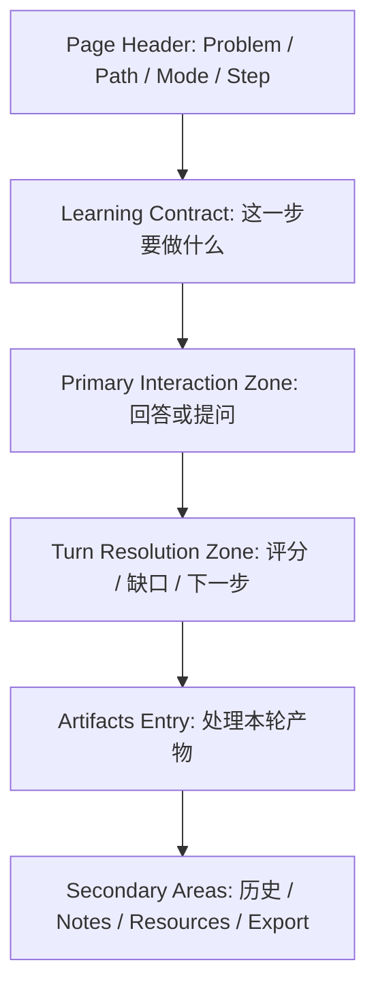

# ProblemDetail 高层 UI 重构方向

更新时间：2026-03-12

用途：
- 作为 `ProblemDetail` 下一轮大改的高层设计依据
- 从产品与学习结构出发，而不是从当前代码实现出发
- 尤其用于指导页面布局、信息层级、交互节奏的重构

相关基线文档：
- [Cogniforge 产品定位与学习使用流程参考](/Users/asteroida/work/Cogniforge/docs/plans/2026-03-12-cogniforge-product-positioning-and-learning-flow-zh.md)

---

## 1. 前提判断

这次 UI 优化不应该理解成“继续微调当前页面”，而应该理解成：

> 重新定义 `ProblemDetail` 作为主学习工作区，应该以什么空间组织方式承载一次结构化学习。

这意味着：

- 不以当前两栏布局为前提
- 不以当前已有卡片分组为前提
- 不以“已有组件放哪里最省改动”为前提
- 以用户的学习节奏和认知负担为前提

---

## 2. 当前页面为什么从结构上不顺

### 2.1 它更像“状态仪表盘”，不像“学习工作台”

当前 `ProblemDetail` 最大的问题，不是信息少，而是信息组织方式更像 dashboard：

- 一个总览卡
- 一个上下文卡
- 一个强化卡
- 一个当前步骤卡
- 一个本轮产物卡
- 一个 Notes / Resources 卡

这些区块都“有道理”，但组合起来之后，页面更像：

> 系统在同时展示很多状态

而不是：

> 用户正在沿着一条学习轨道完成当前任务

### 2.2 页面没有单一视觉主轴

一个主学习工作区必须有明确主轴。

当前页面的问题在于，用户进入后视觉上同时被拉向：

- 当前问题
- 当前模式
- 当前路径
- 当前步骤
- 当前输入区
- 本轮产出
- 概念治理
- 路径治理
- 强化上下文

这会导致用户虽然什么都能看到，但无法一眼判断：

- 先看哪块
- 先做哪步
- 哪块只是辅助信息

### 2.3 页面按“系统对象”分块了，但没有按“学习时间顺序”组织

从学习过程看，用户真正经历的是：

1. 进入当前任务
2. 理解自己在哪条路径、哪一步
3. 完成当前模式下的一轮交互
4. 看系统如何评价这一轮
5. 再决定处理哪些派生产物

但当前页面不是按这个时间顺序展开，而是把所有对象一次性铺开。

结果就是：

- 用户还没开始答题，就先看到了治理区
- 用户还没完成当前回合，就先被提醒好多二级动作
- 用户还没决定是否继续主线，就先进入资产处理心态

### 2.4 当前布局放大了“学习”和“治理”抢焦点的问题

这个页面本质上同时承载两类任务：

#### A. 学习任务
- 回答问题
- 提问探索
- 理解当前步骤
- 继续主线

#### B. 治理任务
- 接受或忽略概念
- 选择路径候选
- 提升为知识卡
- 加入复习

当前布局的问题不是治理功能存在，而是：

> 它们被放到了和主学习动作差不多同一级的视觉层级

这会直接打断学习节奏。

### 2.5 当前页面没有把“当前回合”与“工作区上下文”彻底分层

工作区上下文是长期的：
- 问题
- 路径
- 当前步骤
- 模式

当前回合是瞬时的：
- 我这轮问了什么
- 我这轮答了什么
- 系统这轮判了什么
- 这轮生成了哪些概念和路径

现在这两层内容在视觉上交织得太紧，导致用户难以判断：

- 哪些是现在这个 turn 的结果
- 哪些是长期背景

---

## 3. 下一版页面应该遵循什么结构原则

### 3.1 先围绕“当前学习合同”组织页面

首屏首先应该回答一个完整的学习合同：

- 我在学哪个问题
- 我当前在哪条路径
- 我当前在第几步
- 我现在是被评估还是在探索
- 我现在这一轮要做什么

如果页面首屏不能清楚表达这五件事，后面的治理和资产都没有意义。

### 3.2 页面必须有一个连续的主学习轨道

下一版页面不应继续是“多个并列卡片”。

它应该有一个清晰的主轨道，自上而下依次承载：

1. 当前学习合同
2. 当前模式下的交互区
3. 本轮结果
4. 本轮产物处理入口
5. 历史与辅助信息

也就是说，它更像一条学习流程，而不是一个仪表盘。

### 3.3 治理动作必须晚于学习动作暴露

概念治理、路径治理、知识卡沉淀不是不重要，而是时机不该抢在学习动作之前。

设计原则应该是：

- 默认先完成一轮学习
- 学完之后再处理这轮产物
- 治理是第二阶段，不是和主学习动作并列的第一阶段

### 3.4 页面布局必须把“长期结构”和“当前回合”分开

应该明确区分：

#### 长期结构
- Problem
- Path
- Step
- Mode
- Reinforcement context

#### 当前回合
- 当前问题/当前提问
- 当前回答
- 当前评分/反馈
- 当前派生产物

UI 不能让这两层混在同一个层级上互相抢注意力。

### 3.5 首屏只允许一个主任务

用户进入 `ProblemDetail` 首屏时，只应该感到：

> 我现在先完成这一步

而不是：

> 我好像同时可以答题、提问、治理概念、选路径、去复习、去看模型卡、做笔记、导出记录

---

## 4. 建议的高层布局模型

我建议下一版 `ProblemDetail` 采用：

> 单主轨道 + 上下文轻条 + 次级抽屉/折叠区

而不是：

> 长期双栏 + 多卡片并列

### 4.1 结构示意

### 4.2 顶部不应该再是“多卡摘要区”

顶部应该收缩成一个轻量但高信息密度的 `Learning Header`：

- Problem 标题
- 当前路径
- 当前步骤
- 当前模式
- 必要的进度信息

不要在顶部再堆 2 到 4 张摘要卡。

顶部作用是“定向”，不是“展开信息”。

### 4.3 首屏主区应该是一个完整学习单元

首屏最核心的区域应该是：

#### Learning Contract
- 当前学习目标
- 为什么在学这个
- 当前模式说明
- 当前通过标准或预期结果

#### Primary Interaction Zone
- Socratic：当前问题 + 回答框 + 提交
- Exploration：当前提问框 + 回答类型 + 提交

这两个区块应该在视觉上连成一个整体，而不是拆成不同卡片分散在页面里。

### 4.4 本轮结果应该紧跟在交互区后面

用户提交之后，最需要立刻看到的是这轮结果。

所以结果区应该紧跟在主输入区后面，回答：

- 这轮过没过
- 系统判定我差在哪
- 这轮最关键的产出是什么
- 下一步最推荐做什么

这个区域应该是主轨道的第二段，不应该退到远处侧栏。

### 4.5 派生产物要变成“第二阶段工作区”

概念候选、路径候选、提升知识卡、加入复习，这些应该放在一个明确的“处理本轮产物”区域里。

推荐形式：

- 默认折叠摘要
- 用户点击后展开完整治理区
- 展开后也应该有清晰分区：
  - Concepts
  - Paths
  - Knowledge asset actions

这样用户会理解：

> 我已经完成了这轮学习，现在进入产物处理阶段

而不是：

> 学习和治理同时在进行

### 4.6 Notes / Resources / Export 必须全部降级

这些都属于工具动作，不属于主学习动作。

建议：

- 放入次级折叠区
- 或放入“More”菜单 / 辅助工具带
- 不进入首屏一级动作区

---

## 5. 三种高层布局方案对比

### 方案 A：单主轨道 + 底部折叠区

特点：
- 从上到下是一条完整学习路径
- 次级信息全部放到底部折叠区

优点：
- 最符合“学习是顺序过程”的产品模型
- 最适合 `ProblemDetail` 作为主学习工作区
- 最容易把学习动作和治理动作拆层

缺点：
- 页面会更长
- 需要认真设计折叠区和回合切换动画

结论：
- **最推荐**

### 方案 B：主轨道 + 右侧上下文抽屉

特点：
- 页面主区只有一个学习轨道
- 右侧只保留可收起的上下文抽屉

优点：
- 宽屏利用率更好
- reinforcement / path context 可以在需要时常驻

缺点：
- 容易再次滑回“长期双栏”
- 如果抽屉内容过多，又会复发当前问题

结论：
- 可以作为方案 A 的增强版
- 但前提是右侧只能是轻量抽屉，不是第二主区

### 方案 C：分步式 Wizard 布局

特点：
- 把页面拆成：
  - 当前任务
  - 回答
  - 结果
  - 产物处理

优点：
- 非常强的流程感

缺点：
- 容易过度流程化
- 会压缩 Exploration 的自由度
- 不利于 branch / reinforcement 的灵活回流

结论：
- 不适合作为主方向

---

## 6. 页面里哪些东西应该退场

### 6.1 不该常驻首屏的内容

- Export
- Open Review Hub
- Open Model Cards
- Notes
- Resources
- 全量概念治理动作
- 全量路径治理动作

### 6.2 不该继续并列展示的内容

- “当前步骤摘要”
- “下一步摘要”
- “模式摘要”
- “路径摘要”
- “本轮摘要”

这些不是不能要，而是不该继续分散在多个平级卡片里。

### 6.3 不该继续保留的页面心智

`ProblemDetail` 不该继续像：

- 项目管理页
- 数据治理台
- 多卡片控制面板

它应该更像：

- 一个围绕当前步骤组织的学习工作台

---

## 7. 下一版页面的推荐信息层级

### Level 0：学习定位
- Problem
- Path
- Step
- Mode

### Level 1：当前学习合同
- 当前目标
- 为什么现在做这个
- 当前模式下的任务说明

### Level 2：主交互
- 回答或提问
- 提交动作
- 必要提示

### Level 3：本轮结果
- 评分/掌握度
- 缺口诊断
- 下一步建议

### Level 4：本轮产物处理
- Derived concepts
- Derived paths
- Promote / Review

### Level 5：次级辅助
- 历史
- Notes
- Resources
- Export

---

## 8. 对后续 UI 重构的直接建议

### 8.1 先画“学习节奏”，再画页面块

下一步不要直接拿现有页面继续拖区块。

应该先定义：

1. 用户进来第一眼看到什么
2. 用户提交后第一眼看到什么
3. 用户什么时候处理产物
4. 用户什么时候看历史和辅助信息

### 8.2 先出线框，不先写组件

这次不适合边写代码边想布局。

更稳的顺序是：

1. 先做信息层级图
2. 再做 1 到 2 个高层线框
3. 再决定 `ProblemDetail` 要不要拆组件

### 8.3 第一轮重构优先解决布局与节奏，不优先解决视觉细节

第一轮真正该解决的是：

- 主轴混乱
- 学习与治理抢焦点
- 当前回合与长期上下文混层

不是：

- 字体
- 圆角
- 色彩
- 细节动画

---

## 9. 一句话结论

`ProblemDetail` 的问题，不是“组件太多”，而是：

> 页面仍在用仪表盘式布局承载一个本质上应该按学习时间顺序展开的工作台。

所以下一轮 UI 优化不该是“再调一下两栏或卡片顺序”，而应该是：

> 重建一个以单主学习轨道为核心、以当前学习合同为起点、以回合结果和产物处理为后续阶段的工作区结构。

