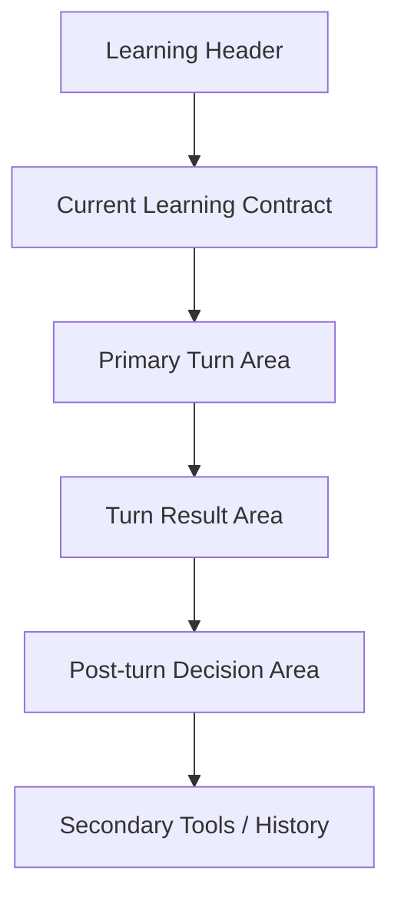

# Cogniforge 主学习工作区重构原则

更新时间：2026-03-12

用途：
- 作为下一阶段 UI 重构的总原则
- 用最终目标判断设计合理性，而不是被当前实现牵着走
- 尤其用于约束 `ProblemDetail`、入口流程、Reviews 的重构方向

这份文档不是对当前页面的修补建议，而是对“Cogniforge 最终应该成为怎样的学习系统”的界面表达约束。

---

## 1. 北极星目标

Cogniforge 的目标不是把很多学习功能堆在一个页面里，而是让用户可以稳定完成这条任务链：

```text
确定问题 -> 选择学习协议 -> 完成一轮学习 -> 理解这轮结果 -> 决定下一步去向 -> 沉淀知识 -> 进入复习 -> 回流强化
```

所有 UI 判断，都应该服务这条链，而不是服务当前组件树、当前接口形状、或当前已有卡片。

一句话定义：

> Cogniforge 是一个结构化学习工作台，不是聊天壳，不是治理后台，也不是知识资产控制台。

---

## 2. 设计判断标准

后续任何 UI 改动，都应该先回答下面 5 个问题。

如果不能回答，就说明设计方向有问题。

### 2.1 用户进入页面后，3 秒内能否知道自己现在在做什么

必须清楚：
- 当前在学哪个问题
- 当前在哪条路径
- 当前在第几步
- 当前处于哪种协议
- 当前该做的动作是什么

### 2.2 用户完成一轮交互后，5 秒内能否知道结果如何

必须清楚：
- 这一轮有没有推进
- 这一轮哪里没懂
- 这一轮产出了什么
- 下一步最推荐做什么

### 2.3 用户是否会在学习动作和治理动作之间迷路

如果页面让用户同时面对：
- 答题/提问
- 概念审核
- 路径编排
- 资产提升
- 复习入口

那么这个页面基本就是失败的。

### 2.4 用户是否能感知自己离开主线的原因

如果进入 prerequisite / comparison / branch 时，用户不知道：
- 为什么离开主线
- 当前在补什么
- 什么时候回去

那就是结构表达失败。

### 2.5 用户是否被迫理解系统内部实现

如果用户需要理解：
- insertion
- bookmark
- merge target
- current turn id
- selected insertion

这种系统词汇才能做决定，说明 UI 已经过度暴露实现细节。

---

## 3. 非目标

这轮重构不追求：

- 修饰已有卡片布局
- 继续给 `ProblemDetail` 加摘要卡
- 在不改结构的情况下微调间距和颜色
- 把所有功能都保留在同一层级

也不应该先做：

- 全站视觉大翻新
- 大规模命名美化
- 围绕现有组件做“看起来更整齐”的重排

如果学习主线不顺，视觉精修没有意义。

---

## 4. 页面职责必须重新收口

### 4.1 Dashboard

只负责一件事：

> 告诉用户现在最该继续什么

它不是学习工作区，不承担治理，不承担深度决策。

### 4.2 Problems

只负责两件事：

- 选择一个要继续的问题
- 新建一个要学习的问题

它不是模式切换台，也不是轻量工作区。

### 4.3 ProblemStart

这不是必须单独做成页面，但必须成为一个明确步骤：

> 用户在真正进入工作区之前，先确定本次从哪种协议开始

这里必须做到：
- `socratic`
- `exploration`

两个协议都显式落库，不允许一个是默认值、一个是显式值。

### 4.4 ProblemDetail

只负责一件核心任务：

> 承载当前这一个问题下的结构化学习执行

它应该是学习工作台，不应该同时兼任：
- 资产中心
- 大量治理后台
- 多入口导航台

### 4.5 Reviews

只负责：

> 当前该复习什么，以及如何回工作区强化

它不应该继续承担：
- 复盘归档主入口
- 新建 review 生成器主入口
- 多个概念混杂的总后台

### 4.6 Model Cards

只负责：

> 沉淀后的长期知识资产管理

不应该反向挤占主学习工作区的注意力。

### 4.7 Secondary surfaces

以下页面在重新接入主线之前，应视为次级面：

- Chat
- Practice
- Notes
- Resources
- Challenges
- Knowledge Graph

它们不应该继续占产品心智中心。

---

## 5. ProblemDetail 的最终角色

`ProblemDetail` 不是“把所有相关功能放在一起”的页面。

它的最终角色应该是：

> 用户围绕一个问题，在当前路径和当前步骤上，完成一轮有效学习，并据此决定是否推进、分支、补前置或沉淀知识。

这意味着 `ProblemDetail` 必须优先表达“学习执行”，不是优先表达“学习系统的全部状态”。

---

## 6. ProblemDetail 的正确空间模型

### 6.1 不再使用“仪表盘思路”

当前页面最根本的问题，是用 dashboard/console 的空间模型在承载学习。

错误模型是：
- 多摘要卡
- 多平级面板
- 多并行信息区
- 用户自己判断先看哪块

正确模型应该是：

> 单一主学习轨道 + 轻量上下文 + 回合后处理区

### 6.2 推荐空间结构



### 6.3 结构含义

#### A. Learning Header
只负责定向：
- Problem
- Path
- Step
- Mode

不堆卡片，不放工具栏。

#### B. Current Learning Contract
只回答：
- 当前任务是什么
- 为什么现在做这个
- 本轮的完成标准是什么

#### C. Primary Turn Area
只承载当前协议下的一轮动作：
- Socratic：系统问题 + 用户回答
- Exploration：用户问题 + 系统解释请求

#### D. Turn Result Area
提交后默认出现，不能藏起来。

这里必须优先展示：
- 是否推进
- 为什么
- 哪个点没掌握
- 建议下一步

#### E. Post-turn Decision Area
这才是概念和路径治理出现的位置。

也就是说：
- 先学
- 再看结果
- 再处理产物

#### F. Secondary Tools / History
包括：
- Notes
- Resources
- Export
- 历史记录

这些都必须降级。

---

## 7. ProblemDetail 的信息层级

### Level 0：定位信息
- Problem
- Path
- Step
- Mode

### Level 1：当前学习合同
- 当前任务
- 当前目标
- 通过标准

### Level 2：当前回合动作
- 问题或提问
- 输入区
- 提交动作

### Level 3：本轮结果
- 评分 / 掌握度
- 缺口诊断
- 下一步建议

### Level 4：本轮产物
- 派生概念
- 派生路径
- 提升知识卡
- 加入复习

### Level 5：辅助工具
- 历史
- Notes
- Resources
- Export

任何超出这个顺序的布局，都应该被视为可疑。

---

## 8. 学习模式必须被当成一级协议

### 8.1 入口阶段

模式选择不能再只是“创建后补一个 toggle”。

正确要求：
- 用户在进入工作区之前就明确本次从哪种协议开始
- 两种协议都显式写入状态
- 不允许一边是默认、一边是显式设置

### 8.2 工作区阶段

模式切换不能再只是视图 tab。

它必须表示：
- 当前这轮学习合同改变了
- 当前回合边界已经切换
- 旧模式结果应退为历史或上一轮结果

### 8.3 结果阶段

不同协议产生的结果必须用不同语言表达：

- Socratic：掌握度、缺口、推进判断
- Exploration：解释结果、相关概念、可延伸方向

如果看起来像一套 UI 只是文案不同，那就是协议表达失败。

---

## 9. 前置补课与分支必须成为显式结构

用户最容易迷路的地方，就是离开主线时没有明确结构提示。

所以后续重构必须遵守：

### 9.1 一旦检测到前置缺口，就显式进入 prerequisite branch

不要继续把前置补课揉在主步骤文案里。

### 9.2 分支必须告诉用户三个信息

- 为什么进入这个分支
- 现在补的是什么
- 满足什么条件后回主线

### 9.3 回主线必须成为显式事件

不能让“回主线”只是某个状态值变了。

用户必须明确感知：
- 我刚才在补前置
- 现在已经回到主线

---

## 10. 本轮结果不能再退到右侧产物区

这是后续重构必须严格执行的一条。

### 原则

> Turn outcome 不是“产物治理的一部分”，而是“当前学习是否成功”的直接反馈。

所以：
- 不能再藏在“处理本轮产出”后面
- 不能再要求用户自己去右侧找
- 不能再和概念治理/路径治理混在一起

### 默认行为

用户提交后，页面默认先呈现：

1. 结果
2. 原因
3. 建议下一步

之后才是：

4. 概念与路径产物处理

---

## 11. 概念和路径治理必须改成“回合后处理”

### 11.1 概念候选

它们不是当前回合的主任务，而是当前回合的后续处理项。

默认只需要摘要：
- 这轮发现了几个概念
- 哪个最重要
- 是否建议沉淀

不要默认展开成内容治理后台。

### 11.2 路径候选

同理，默认只展示：
- 为什么建议开新路径
- 这是前置、比较还是深挖
- 推荐下一步是什么

不要在首屏直接给用户实现级按钮组。

### 11.3 行为文案要用用户意图词

不要优先暴露：
- insert_before_current_main
- bookmark
- selected_insertion

应该优先表达用户意图：
- 先补这个
- 稍后再学
- 单独深入
- 现在忽略

---

## 12. Reviews 的最终角色

后续 Reviews 应该彻底收口为：

> 当前复习任务与回工作区强化入口

因此：
- 复习队列保留
- 回工作区强化入口保留
- archive 降级
- new review 生成器移出主区或移出本页

如果一个用户进入 Reviews 后还要花时间判断“这是做 recall、做归档、还是做生成器”，那就是职责没有收口。

---

## 13. 可以砍的，不要犹豫

如果后续重构要做取舍，优先砍这些“首屏暴露”：

- Export
- Open Review Hub
- Open Model Cards
- Notes
- Resources
- 全量概念治理动作
- 全量路径治理动作
- 冗余摘要卡

这些不是功能上删除，而是从首屏一级位置撤下去。

---

## 14. 重构顺序

### 第一阶段：先定结构，不写样式

先做：
- 页面职责收口
- ProblemDetail 信息层级图
- 线框图
- 回合前后状态图

不要先做：
- 视觉 polish
- 颜色和圆角
- 组件重命名

### 第二阶段：先重建 ProblemDetail 主轨道

优先完成：
- Learning Header
- Current Learning Contract
- Primary Turn Area
- Turn Result Area

### 第三阶段：再接回产物处理和回流强化

最后再接：
- concept governance
- path governance
- reinforcement context
- tools

顺序不能反。

---

## 15. 最终判断标准

当新版本出来后，只看这三个问题：

### 15.1 用户进入 ProblemDetail 后，是否立刻知道当前任务

如果不能，重构失败。

### 15.2 用户完成一轮交互后，是否立刻理解结果和下一步

如果不能，重构失败。

### 15.3 用户是否还能在学习与治理之间迷路

如果还会，重构失败。

---

## 16. 一句话结论

后续 UI 重构不应该继续围绕“当前页面怎么摆更整齐”，而应该围绕：

> 如何把 `ProblemDetail` 从一个多功能控制面板，重建成一个围绕当前学习回合展开的主学习工作台。

